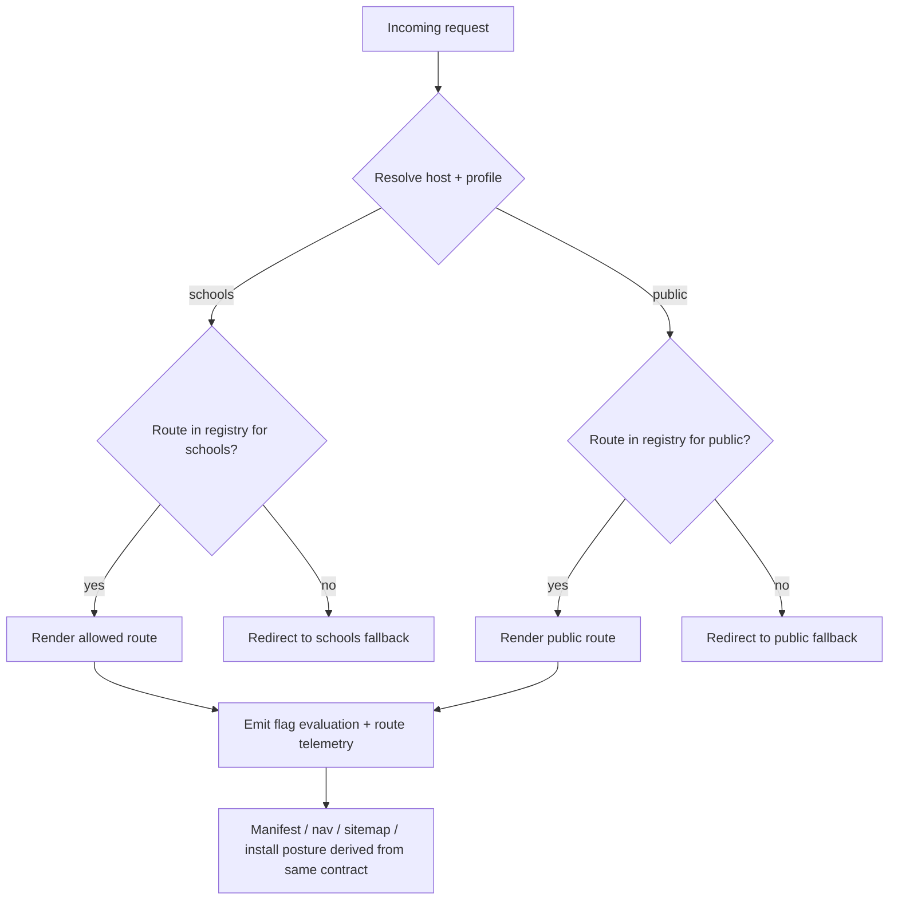

# Master blueprint for BSS and blkck2

## Executive summary

The two public codebases are not at the same architectural maturity. `Blackcockatoo/bss` is a Next.js App Router application on modern dependencies, with middleware, a profile-driven child-safe boundary, a lightweight service worker, dedicated CI, and a separate smoke-gate workflow for school deployments. `Blackcockatoo/blkck2` does not appear to exist publicly under that exact repository name; the public repository `Blackcockatoo/blkck` appears to be the live `blkck2.com` codebase because its `CNAME` is `blkck2.com`, its Netlify config redirects traffic to `https://blkck2.com`, and its root tree contains the deployed HTML, service worker, manifest, and `i-ran-lego` import assets.

The strongest reusable blueprint is therefore not "make blkck2 behave like bss" or "make bss behave like blkck2". It is to extract a shared **deployment contract** with six modular layers: a profile contract, a route-surface registry, a cache policy registry, a deployment/domain contract, an asset import pipeline, and a release-quality gate. The current repositories already hint at each of these, but they are fragmented. In `bss`, profile logic is split between middleware, manifest generation, route guards, tests, and smoke runbooks; in `blkck`, route aliases, domain redirects, service worker behaviour, and ZIP import are spread across `_redirects`, `netlify.toml`, `vercel.json`, `sw.js`, and a Python build script.

The most important near-term fixes are straightforward. First, centralise routing and profile decisions so that landing pages, middleware redirects, manifest start URLs, navigation labels, and service-worker scope all read from one source of truth. Right now `bss` contains a Vercel root redirect to `/metapet-landing.html`, a Next home page at `/`, and a schools-mode middleware expectation that `/` redirects to `/schools`; that is a classic configuration split-brain. Second, replace manual cache naming and duplicated redirect rules with generated manifests and a platform-neutral config layer. Third, stop treating ZIPs and large binaries as ad hoc repo-root artefacts and move to an import manifest plus release-asset or Git LFS backed distribution. Fourth, separate lint, unit tests, build, and smoke verification into independent CI jobs so failures are diagnosable and rollback decisions are obvious.

## Repository and platform baseline

`bss` is a Next.js 16.1.1 application using React 19.2.3, Vitest, ESLint, Biome, Zustand, and `@vercel/analytics`. Its build script also runs a Moss60 preparation step before `next build`, which means release correctness already depends on build-time asset preparation rather than purely on source files. The repository includes source modules for app routes, school docs, steering/navigation components, genome features, tests, PDFs, DOCX files, ZIP archives, and Vercel redeploy text markers.

The public `blkck` repository is a static site rather than a framework app. Its file tree is dominated by HTML documents, media files, a `sw.js`, `_redirects`, `netlify.toml`, `vercel.json`, and a Python build script that unpacks `I_RAN_LEGO_LIVING_BOOK_v1.zip` into `/i-ran-lego`, patches the imported app, inserts return links and purchase-enquiry paths, writes a local service worker for the living-book artefact, updates the B$S portal content, validates expected page counts and audio sizes, and deletes the source archive after build. Recent Actions history also shows repeated failures in `.github/workflows/import-i-ran-lego.yml`, especially on the `main` branch and several feature branches, which makes the import path operationally brittle.

The best reading of the current state is that `bss` already contains the seeds of a safe, profile-aware application platform, while `blkck` is a content-forward static distribution platform with bespoke import logic. That means the right master blueprint is **shared contracts, different runtimes**: the same profile, route, cache, asset, and deploy schemas should drive both projects, but the adapters should remain runtime-specific for Next.js and static Netlify/Vercel deployments. OpenFeature's provider, evaluation-context, hooks, and event model is a good fit for the shared contract layer because it supports domain-scoped providers, contextual evaluation, lifecycle hooks, and provider readiness/error events without locking you into one vendor or one storage backend.

A practical comparison of candidate approaches looks like this:

| Area | Approach | Pros | Cons | Risk | Compatibility |
|---|---|---|---|---|---|
| Profile and access boundary | **Host-scoped builds** such as `www.bluesnakestudios.com` for public and a dedicated schools domain for school mode | Cleanest mental model; aligns with current `bss` smoke gate and `NEXT_PUBLIC_SITE_URL` contract; easy domain-specific manifests and metadata. | Requires disciplined environment management and separate promotion paths. | Low | High for both codebases |
| Profile and access boundary | **Single build with route guards** | Fewer deployments; simpler hosting footprint. | Metadata, manifest, and cache behaviour become ambiguous because special files can be cached and service workers remain shared. | Medium | Medium for `bss`, weak for `blkck` |
| Cache invalidation | **Generated hashed precache / Workbox-style policy** | Strong invalidation guarantees; reduces manual version bumps; recommended for precache freshness. | Slight tooling overhead. | Low | High |
| Cache invalidation | **Manual cache version strings** like `meta-pet-shell-v2` or `moss-tree-v15` | Simple to understand; already in place. | Easy to forget; drift between app shell and static assets; more rollback pain. | Medium | High |
| Asset distribution | **GitHub release assets plus import manifest** | Release assets support large binaries up to 2 GiB each; controlled promotion; cleaner git history. | Requires a release step. | Low | High |
| Asset distribution | **Git LFS** | Better than storing large binaries as normal git objects; `.gitattributes` can be shipped in archives. | Ongoing storage/bandwidth management; not ideal for every deploy-time artefact. | Medium | High |
| CI design | **Split jobs for lint, unit, build, smoke** | Clearer failures; faster feedback; easy required-check policy. | Slightly more workflow authoring. | Low | High |

## Routing and child-safe feature-flag blueprint

The current `bss` child-safe design already has the correct primitives, but they are over-coupled and spread across too many files. `NEXT_PUBLIC_CHILD_SAFE_BASELINE` and `NEXT_PUBLIC_APP_PROFILE` are read in `src/lib/env/features.ts`, where enabling the child-safe baseline can implicitly force the whole app into the `schools` profile. Middleware then redirects `/` to `/schools` in schools mode and sends blocked routes to a fallback path, while server and client route guards enforce the same policy inside pages. Tests confirm that schools mode blocks `/app`, `/compass`, `/pet`, `/identity`, and `/genome-resonance`, while allowing `/schools`, `/school-game`, `/legal/privacy`, and school docs.

The root cause of routing fragility is that **policy and presentation are not reading from the same registry**. The steering wheel still publishes consumer routes such as `Shop`, `Digital DNA`, `Identity`, `Genome Resonance`, `Lineage`, and `QR Messaging`, while the schools mode explicitly blocks many of those routes and the activities page hides the navigator entirely when `IS_SCHOOLS_PROFILE` is true. At the same time, `/compass` is implemented as a redirect to `/app/activities`, yet the root landing page still advertises "Open Navigator", and the live `/compass` page currently renders a "Preparing the privacy-first demo" shell with only `Home`, `Pet`, `School`, and `Identity` visible. That combination strongly suggests a route-surface mismatch rather than a single broken component.

The concrete blueprint component here should be a **Route Surface Registry** plus a **Profile Contract**:

```ts
// app-contract.ts
export type AppProfile = "public" | "schools";

export type RouteIntent =
  | "landing"
  | "navigator"
  | "classroom"
  | "document"
  | "consumer"
  | "admin";

export interface RouteRule {
  path: string;
  intent: RouteIntent;
  profiles: AppProfile[];
  navLabel?: string;
  discoverable?: boolean;
  fallbackByProfile?: Partial<Record<AppProfile, string>>;
  installVisible?: boolean;
}

export interface ProfileContract {
  profile: AppProfile;
  domain: string;
  startUrl: string;
  manifestName: string;
  allowInstall: boolean;
  childSafeBoundary: boolean;
}
```

That contract should become the source for middleware matching, navigation rendering, manifest generation, landing-page CTAs, sitemap inclusion, school smoke tests, and service-worker navigation fallbacks. The current `bss` test suite shows the policy you want; the missing step is to make that policy declarative and shared. OpenFeature can sit one layer above this registry so that route visibility, install posture, adult-only tools, and experiments are evaluated against a formal context such as `{ profile, host, audience, routeIntent }`, with hooks logging every non-default evaluation.

The routing and flag flow should look like this:



**Integration steps.** Start by creating a single `contracts/routes.ts` file in `bss`, and then adapt middleware, `manifest.ts`, landing pages, and steering navigation to consume it. In `blkck`, compile the same registry into `_redirects`, `netlify.toml`, and the generated studio sections file so alias paths, public pages, and school/professional views are produced from one source instead of being hand-maintained in multiple files.

**Automated tests.** Add contract tests that assert: every discoverable route exists in the registry; every schools-allowed route is excluded from consumer-only navigation; every manifest start URL exists in the route registry; every redirect target is a declared route; and every host-profile pair resolves to exactly one landing route. Keep current `childSafeBaseline` and middleware tests, but generate most assertions from the registry rather than hard-coding them.

**Rollout and rollback.** Implement this first in `bss` behind a `route_contract_v1` flag, then compile static outputs for `blkck`. Rollback is easy: keep existing middleware and `_redirects` files generated side-by-side until parity is proven. Estimated effort: **M** for `bss`, **M** for `blkck`, **L** to make the contracts reusable across both.

**Monitoring and alerts.** Emit events for "blocked route attempted", "fallback redirect executed", "navigator target missing", and "manifest/profile mismatch". Alert if a schools host serves a manifest whose `start_url` is not `/schools`, or if a page marked non-discoverable appears in nav or sitemap. That directly addresses the current split among route guards, static landing pages, and manifest generation.

## Service-worker, cache invalidation, and deployment blueprint

`bss` and `blkck` have opposite service-worker strategies. `bss` intentionally keeps its service worker narrow: it precaches only manifest and icon files, refuses to cache page navigations or `/_next` assets, deletes old caches on activation, and forces one-time reloads of open tabs so stale loader shells do not pin users to mismatched JavaScript chunks. `blkck`, by contrast, uses a manually versioned cache name, preloads a large application shell including many HTML pages, documents, icons, and downloads, serves navigations with a network-first strategy that falls back to cached `index.html`, serves shell items network-first, and serves other small assets with stale-while-revalidate while leaving video network-only.

Both patterns are defensible, but neither is ideal as a shared blueprint. Browser guidance and Workbox guidance both recommend separating navigation handling from asset handling, using network-aware strategies for HTML, considering navigation preload, and versioning or hashing static assets so stale runtime caches do not hold onto old resources. Workbox also explicitly documents the "deploy a no-op service worker" recovery pattern for buggy workers, which is the cleanest emergency rollback mechanism you can build into both projects.

The right modular component is a **Cache Policy Registry**:

```ts
export type CacheStrategy =
  | "network-only"
  | "network-first"
  | "stale-while-revalidate"
  | "precache";

export interface CacheRule {
  match: string;
  strategy: CacheStrategy;
  cacheName?: string;
  maxAgeSeconds?: number;
  scope: "navigation" | "shell" | "asset" | "media" | "doc";
  rollbackSafe?: boolean;
}

export interface CacheContract {
  version: string;          // derived from commit SHA or build ID
  rules: CacheRule[];
  emergencyNoop?: boolean;  // kill switch
}
```

For `bss`, generate the cache contract from the Next build ID and keep navigations network-first or network-only, never cache `/_next` chunks in the custom worker, and treat `manifest.webmanifest` carefully because Next metadata routes are cached by default unless made dynamic. For `blkck`, replace hand-maintained `APP_SHELL` arrays with a generated manifest and split documents from HTML pages so PDF or poster additions cannot silently bloat the offline shell.

Deployment-wise, both repos already run on overlapping hosting assumptions. `bss` uses Vercel config with `framework: "nextjs"`, `buildCommand: "npm run build"`, and a root redirect in `vercel.json`; it also derives site URLs from `NEXT_PUBLIC_SITE_URL`, `VERCEL_PROJECT_PRODUCTION_URL`, and `VERCEL_URL`. `blkck` carries both Netlify and Vercel configs, but Netlify is clearly the stronger canonical deployment contract because it owns redirects, headers, security headers, HTML and service-worker cache control, and domain canonicalisation to `https://blkck2.com`. Vercel is only told to run the Python build and publish `.`.

That means the blueprint should define a **single logical deploy contract** and then compile it per platform:

```json
{
  "canonicalHost": "blkck2.com",
  "aliases": ["www.blkck2.com"],
  "enforceHttps": true,
  "landingByHost": {
    "www.bluesnakestudios.com": "/",
    "schools.bluesnakestudios.com": "/schools"
  },
  "headers": {
    "html": "public, max-age=0, must-revalidate",
    "serviceWorker": "public, max-age=0, must-revalidate",
    "static": "public, max-age=31536000, immutable"
  }
}
```

Compile that to `vercel.json`, `next.config.js` redirects/headers where appropriate, `netlify.toml`, and `_redirects`. Netlify's docs allow redirects and headers in either `_redirects` or `netlify.toml`; currently `blkck` duplicates domain rules in both, which increases drift risk. Vercel's redirects are processed at the edge, and its production-domain environment variable is meant for stable canonical URL generation, so use that contract instead of hand-maintaining separate root redirects and host logic.

**Integration steps.** Introduce a `deploy.contract.json`, generate platform-specific files during CI, and make those generated files the only editable deployment outputs. Remove hand-edited duplication once parity is validated. Also add an emergency `noop-sw.js` artefact and release process so a bad service worker can be neutralised quickly.

**Automated tests.** Add snapshot tests for compiled redirects and headers; smoke tests for canonical host, `www` to apex redirects, `http` to `https`, manifest start URL, and service-worker cache headers; and one deploy-time test that confirms `/_next` assets are not intercepted by the custom worker on `bss`. Use existing `site-health.html` patterns in `blkck` as the seed for automated checks.

**Rollout and rollback.** Roll out generated configs first in preview/staging, then production. Keep the old static config files committed for one release only as a backup. Rollback path: redeploy prior commit plus no-op worker if the issue is cache-related. Estimated effort: **M**.

**Monitoring and alerts.** Alert on a rise in service-worker-controlled page loads with stale build IDs, non-zero rates of redirect loops, cache-miss spikes on shell files, and manifest/profile mismatches. If you adopt navigation preload for network-first HTML, monitor navigation TTFB and fallback frequency before and after.

## Asset import and package workflow blueprint

The biggest operational weakness in `blkck` is the living-book import path. The build pipeline expects a repository-root ZIP called `I_RAN_LEGO_LIVING_BOOK_v1.zip`, rejects it if it is unexpectedly small, unpacks it, verifies a fixed set of required files, verifies a specific page count and audio size, copies it into `/i-ran-lego`, rewrites content, writes a service worker, patches portal navigation, validates again, and then deletes the archive. That is clever, but it is still fundamentally a **magic-file build pipeline**. It is fragile when people use different deploy paths, and Netlify's manual deploy documentation is clear that manual deploys without continuous deployment do not run a build command at all. In other words, drag-and-drop or ZIP-based Netlify deploys can skip the import step entirely.

Both repositories also keep sizeable non-code artefacts directly in git history: `bss` includes PDFs, DOCX files, ZIP archives, and redeploy marker files; `blkck` includes ZIPs and MP4s in the repo root. That is manageable for a while, but it is the wrong abstraction for repeatable asset ingestion and release reproducibility. GitHub's own guidance points large binary distribution either toward releases or Git LFS, and release assets support very large files while staying outside normal Git object history.

The modular fix is an **Asset Import Manifest** plus a **resolver** that can fetch from local files, GitHub releases, or LFS-backed paths:

```ts
export interface AssetSource {
  id: string;
  kind: "repo" | "release" | "lfs";
  uri: string;
  sha256: string;
  bytes: number;
}

export interface ImportPackage {
  packageId: string;
  version: string;
  targetPath: string;
  source: AssetSource;
  requiredFiles: string[];
  validators: {
    minPages?: number;
    minAudioBytes?: number;
  };
  patchSteps: string[];
}
```

For `blkck`, the living-book importer should consume this manifest rather than hard-coding one ZIP filename. For `bss`, the same system can govern school handout bundles, Moss60 static exports, or printable packs. The key benefit is that imports become reviewable "content releases" with checksums and version identifiers, instead of silent repo-root replacements.

**Integration steps.** Move `I_RAN_LEGO_LIVING_BOOK_v1.zip` out of normal source control and into either GitHub Releases or Git LFS, commit an import manifest, and update `prepare-i-ran-lego.py` or its replacement to read the manifest. Then add a CI job that validates asset presence and checksum before any deploy build proceeds. If a content package changes, the manifest version changes too; that can then automatically bump cache scope for the imported app.

**Automated tests.** Unit test every validator; integration test one happy-path import and one corrupt-archive path; and add a dry-run mode that verifies required files without writing output. Also test the "build command absent" case for Netlify manual deploys by failing loudly when imported content is missing.

**Rollout and rollback.** First publish asset releases while still leaving repo-root references alive, then flip the resolver. Rollback is as simple as switching the manifest back to the previous asset version. Estimated effort: **M** for the import system, **S** to move individual artefacts.

**Monitoring and alerts.** Emit "import started", "import validated", "import checksum mismatch", and "import skipped due to unsupported deploy mode". Alert immediately if the deployed site serves a stale package version compared with the manifest version expected by the build. That would catch the current class of repeated import-workflow failures far earlier.

## Discoverability and navigation blueprint

The discoverability issues are not just visual polish problems; they are symptoms of structural disconnect. In `bss`, the static landing page explicitly promotes "Open Navigator", but the actual `/compass` route redirects to `/app/activities`, and the live `/compass` response currently shows a preparatory shell rather than a fully visible navigation surface. The activities page conditionally tells the user to use the navigator wheel only when the schools profile is not active. Meanwhile, the steering wheel itself exposes twelve conceptual destinations, but the rendered compass ring filters out `Genome Resonance`, which means the hidden logic and visible layout are already diverging.

There is also evidence that mobile labelling has already been worked on in isolation. `labelUtils.ts` splits long labels across lines on compact viewports, and the network and geometry views both compute text scaling, plate widths, line heights, and separate layout values for compact screens. That means the missing blueprint is not "responsive labels"; it is **discoverability governance**: which routes appear where, under which profile, with what entry affordance, and with what fallback language if a route is currently disabled or hidden.

The reusable component here should be a **Navigation Surface Registry** layered on top of the route registry:

```ts
export interface NavSurfaceEntry {
  route: string;
  label: string;
  shortLabel?: string;
  surface: "landing-cta" | "bottom-nav" | "wheel" | "school-docs" | "site-map";
  profiles: ("public" | "schools")[];
  priority: number;
  hiddenReason?: "blocked" | "beta" | "deprecated";
  mobileLabelPolicy?: "single-line" | "split" | "icon-only";
}
```

That gives you one place to decide that `Navigator` is visible on the public landing page but not on schools builds; that school routes use plain-language labels rather than lore-heavy copy; and that deprecated routes such as `/compass` can remain as aliases while the visible label points to `/app/activities` or its successor. It also creates a clean bridge for `blkck`, where discoverability is currently managed through a mix of index-page sections, `_redirects` aliases, PWA shortcuts, and manual "site health" links.

**Integration steps.** Replace hard-coded landing CTAs and wheel-target arrays with generated entries from the navigation registry. In `blkck`, generate its PWA shortcuts and "friendly aliases" from the same registry so discoverable pages, shortcuts, and redirects are aligned. In `bss`, add route deprecation metadata so `/compass` can issue a measured redirect with analytics rather than silently acting as an alternate path forever.

**Automated tests.** Add a "discoverability parity" suite: every visible CTA must map to an existing route; every route in the wheel must exist in the registry; every school nav item must be allowed by the child-safe boundary; compact labels must render within width constraints; and deprecated aliases must still land on the intended canonical target.

**Rollout and rollback.** Start by instrumenting current surfaces without changing them, then switch one surface at a time: landing CTAs, bottom nav, wheel, school docs, and PWA shortcuts. Rollback is surface-specific because each adapter can continue reading the old config until its replacement is proven. Estimated effort: **S** to **M**.

**Monitoring and alerts.** Track CTA click-through rate, nav-route 404 rate, redirects from deprecated aliases, compact-label overflow incidents, and the ratio of blocked-route attempts from visible UI. If a route receives blocked attempts only via direct URL and not via UI, that is acceptable; if blocked attempts rise after a UI release, discoverability has regressed.

## Quality gates and access-control blueprint

The current `bss` CI is functional but compressed. `ci.yml` runs checkout, Node setup, `npm ci`, lint, tests, child-safe deployment assertion, and build in one `quality` job named "Lint, Test, Build". There is also a second workflow, `production-smoke-gate.yml`, which requires a manual confirmation and smoke owner, reruns lint/build/deployment assertions, and then checks a runbook whose pass criteria include schools-domain routing, blocked-route enforcement, school-safe manifests, classroom runtime health, and privacy page behaviour. That is already a strong quality model in spirit, but because lint, test, deployment assertion, and build are not split, diagnosis is slower than it needs to be.

The `blkck` side shows the opposite problem: the Actions page clearly exposes repeated failures for `.github/workflows/import-i-ran-lego.yml`, but the repo tree does not publicly expose an equivalent, stable, source-visible test and quality-gate structure. That means the asset-import path is operationally important but not yet formalised as a transparent contract in the repository itself.

The master blueprint should therefore standardise on four quality layers:

```yaml
name: quality
on: [push, pull_request]

jobs:
  lint:
    runs-on: ubuntu-latest
    steps: [ ... ]

  unit:
    runs-on: ubuntu-latest
    steps: [ ... ]

  build:
    runs-on: ubuntu-latest
    needs: [lint, unit]
    steps: [ ... ]

  smoke-contract:
    if: github.ref == 'refs/heads/main'
    needs: [build]
    steps: [ ... generated contract checks ... ]
```

For access control, the correct default is **separate public and schools surfaces, not hidden consumer features on one shared public host**. `bss` already encodes that direction through schools-specific route guards, a deployment assertion requiring a dedicated schools domain, and a manual smoke runbook focused on school-safe presentation. `blkck` does not yet do access control; its `/schools` and `/professional` routes are public redirects to `gov.html`, which is content segmentation, not boundary enforcement. So the blueprint should treat `blkck` school/professional pages as public content and reserve true access control for school-only or adult-only tools on dedicated hosts or authenticated paths. Where static edge protection is necessary, Netlify's role-based redirect rules are a workable platform-specific option; on the Next side, request-time route control belongs in middleware or equivalent request-edge logic, not in client-only hiding.

**Integration steps.** Split the current `bss` CI pipeline into independent required checks; add contract-based route and manifest verification; and create a `blkck` import-validator workflow that checks asset manifest integrity before deployment. For access control, define three classes of surface in the shared contract: `public`, `school-reviewed`, and `restricted`. Make only `restricted` surfaces require explicit host or auth checks.

**Automated tests.** Required checks should include route-boundary tests, manifest-domain tests, domain redirect tests, import checksum tests, service-worker policy snapshots, and one Playwright-style smoke suite for the school host. Keep manual smoke signoff, but only after automated smoke has passed.

**Rollout and rollback.** Make the CI split first, because it improves safety for every later change. Then roll in access-boundary changes host by host. Rollback is safe because checks are additive; the main rollback need is to make only one contract file authoritative at a time. Estimated effort: **S** for CI split in `bss`, **M** for `blkck` import validation, **M** for shared access classes.

**Monitoring and alerts.** Alert on failed import validation, school-host route escapes, school-host manifest mismatches, and blocked-route attempts that originate from first-party UI. For restricted surfaces, track unauthorised attempts separately from normal 404s so policy breaches are visible.

## Rollout plan

The order matters. The safest sequence is to stabilise contracts before surfaces, then CI before cache rewrites, then asset movement before domain hardening, and only then full promotion. That sequence minimises the chance of "fixed by deploy, broken by cache" regressions and gives you a clean rollback point at every stage. It also lines up with the current shape of `bss`, where the smoke runbook already assumes a dedicated schools deployment and contract-driven checks, and with `blkck`, where import and redirect drift are the most obvious reliability risks.

```mermaid
flowchart LR
    A[Define shared contracts] --> B[Split CI and add contract tests]
    B --> C[Adopt route and nav registries in bss]
    C --> D[Generate redirects and headers for blkck]
    D --> E[Move large artefacts to release assets or LFS]
    E --> F[Generate cache policies and add no-op SW rollback]
    F --> G[Run schools smoke gate and static site health checks]
    G --> H[Promote to production]
    H --> I[Observe metrics and keep previous manifest/config for rollback]
```



A compact effort view is as follows. **Small**: split `bss` CI jobs, add contract snapshots, deprecate `/compass` cleanly, add route-surface telemetry. **Medium**: build the shared route/profile/navigation contracts, generate platform-specific redirects and headers, move `blkck` import to a manifest-based resolver, and formalise service-worker policies. **Large**: unify both repos around one internal package for contracts, generators, and telemetry hooks, especially if you want a single reusable package consumed by both Next.js and static build tooling. These estimates are driven by the observed code spread, not by speculative rewrite work.

The headline recommendation is simple: treat **routing, cache, deploy, assets, discoverability, and access** as one cause-and-effect system. Right now each repository has parts of that system, but no shared backbone. If you create that backbone first, most of the "obvious fixes" become generated outputs rather than recurring manual clean-up.
